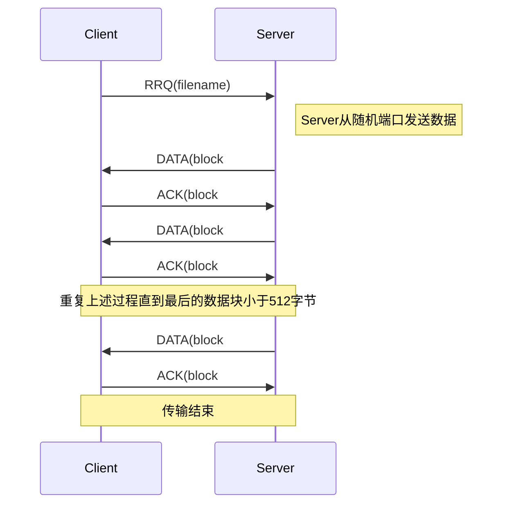
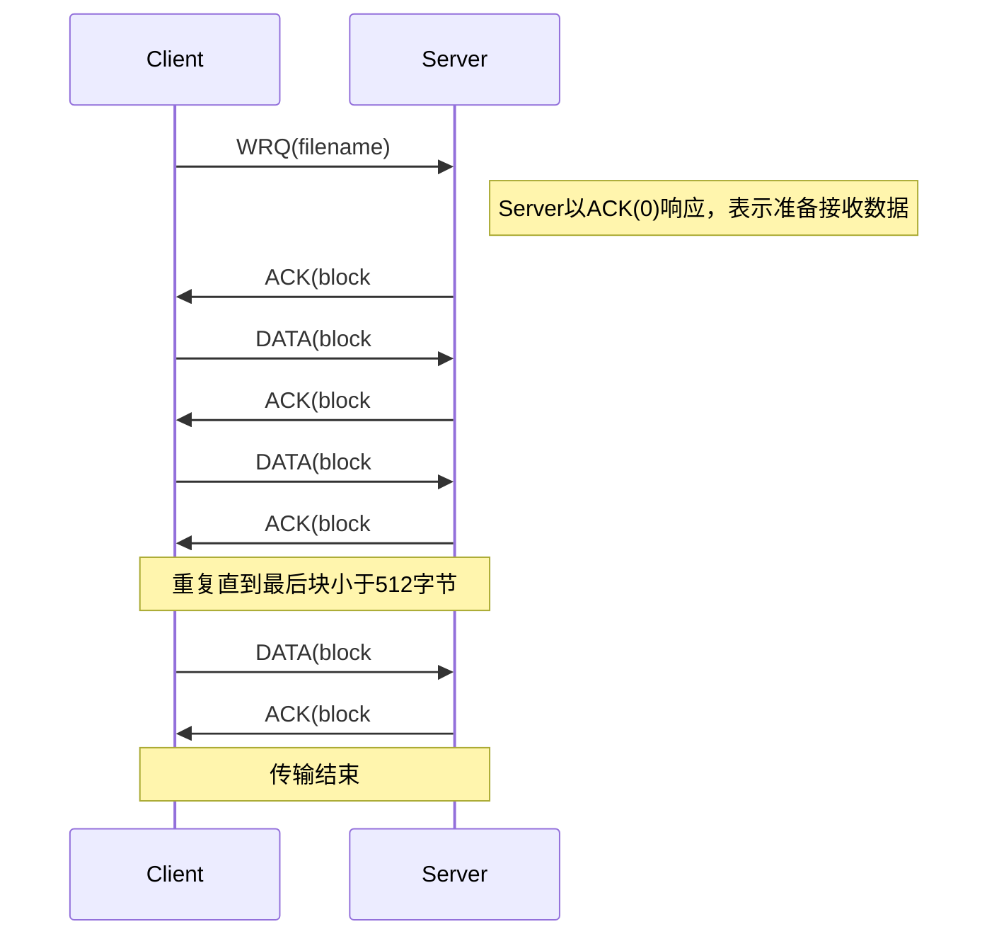
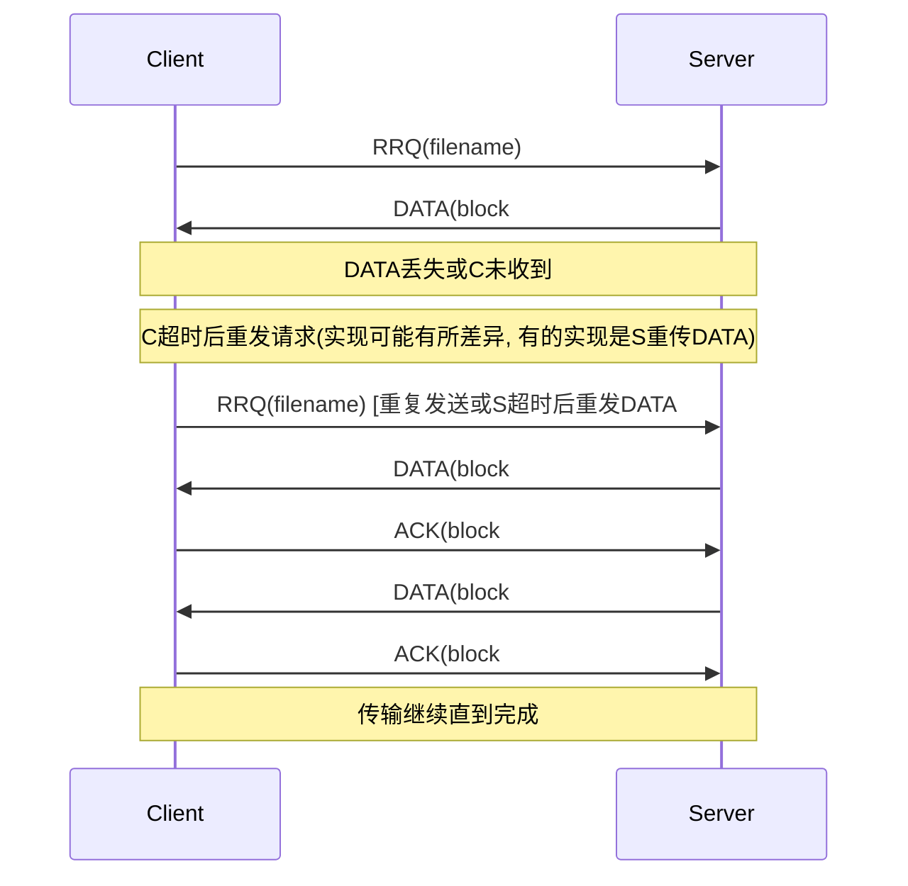
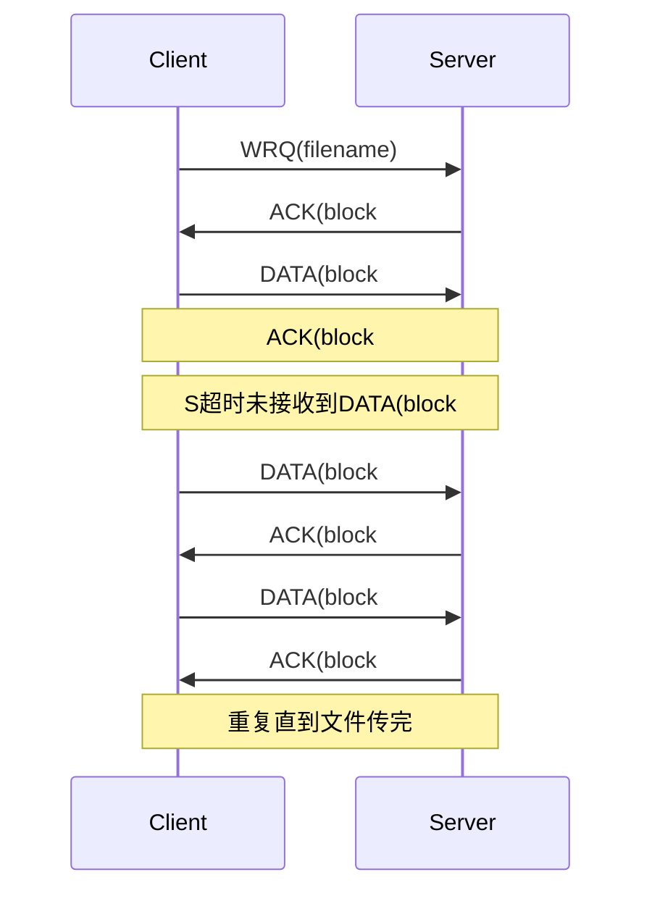
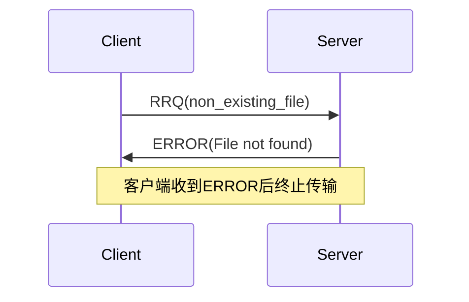

Xmodem 协议环境分析

* 用户要求
  * 连接管理 持久连接
  * 组播 广播 无
  * 服务认可方式 完全认可
  * 通讯方式 半双工、同步
  * 数据形式 流数据
  * 数据长度 文件长度不受限制，传输数据定长 128 字节
  * 服务质量 数据要求无校验错、无丢失、无重复、顺序正确

* 通道性质
  * 通道形成方式 物理信道，无连接管理问题
  * 队列性质 非队列通道
  * RTT 通常靠经验值
  * 数据可靠性 数据在通道中传送有出错的可能，如丢失、错误
  * 通道可靠性 通道可靠
  * MTU 通道单字节方式传送
  * 工作方式 通道支持异步全双工
* 工作模式
  * 点 点模式
  * 主从模式

Xmodem 协议功能分析

* 连接控制功能
  * 无连接管理
* 通信方式管理
  * 发送方以同步方式发送数据报文和接收确认报文
  * 接收方以同步方式接收数据报文和发送确认报文 
* 数据发送 接收管理
  * 对数据报文进行封装（发送方）和解封装（接收方）
  * 对文件（ SDU ）分段（发送方）和装配（接收方）成文件
* 数据安全和可靠管理
  * 在发送端对 PDU 加校验和，在接收端进行校验
  * 对数据报文进行顺序控制（序号）和重发控制（定时器、重发次数）
* 其它功能
  * 对文件进行读（发送方）和写（接收方）操作

Xmodem 协议结构设计

* 分类
  * 接收实体和发送实体
* 分层
  * 协议处理子层
  * 通道接口子层
    * 分类：串行线路接口实体和 UDP 接口实体

Xmodem 协议机制设计

* 重发控制机制
  * 在 Xmodem 协议中，何时何者控制重发数据
    * 接收方发 FREQ 后，长时间收不到数据，接收方重发 FREQ
    * 发送方收到 NAK ，发送方重发数据
    * 发送方长时间收不到 ACK/NAK 时，发送方重发数据
* 如何考虑重发策略
  * 不重发，直接中止
  * 固定定时器时长
  * 按照不同类别的通道，选择不同时长定时器
  * 设计自适应算法，利用 RTT
  * 考虑重发次数

Xmodem 协议元素设计

* 服务原语
  * Xmodem 协议需要四条服务原语
    * 传送文件请求： SendFile_Req CharString
    * 传送文件指示： SendFile_Ind CharString
    * 传送文件响应： SendFile_Resp CharString
    * 传送文件证实： SendFile_Conf CharString Boolean

结论：对协议中没有规定的内容，要根据实际情况做出合理选择

---

你需要做的内容：

* 阅读 TFTP 协议文本 RFC1350 ，完成协议基本功能
  * 可不考虑“魔术师新手综合症”问题
  * 可不考虑“源端口错误”
  * 可不考虑“ ascii 模式”
* 参考关于 Xmodem 协议的分析和设计步骤
* 分析并描述 TFTP 协议的环境、功能、结构、机制、元素
* TFTP有五种协议数据单元 PDU（1 －读请求 RRQ；2 －写请求 WRQ；3 －数据 DATA；4 －确认 ACK；5 －差错 ERROR）
* TFTP有八种错误类型（0：not defined、1：File not found、2：Access violation、3：Disk full、4：Illegal TFTP operation、5：Unknown port、6：File already exists、7：no such user）
* 用 MSC 图（使用Mermaid语法）描述所有可能出现的 PDU 交互过程（每种情况一张图）

（文件传送成功；文件请求 PDU 丢失；文件请求 PDU 校验错；数据包丢失；数据包校验错；确认包/非确认包丢失；文件结束数据包丢失；文件结束数据包校验错；终止文件传送）

---

下面的分析是参考 Xmodem 协议分析与设计步骤，对 TFTP 协议（参见 RFC1350）进行环境、功能、结构、机制、元素的描述。同时给出 TFTP 所有可能出现的 PDU（协议数据单元）交互过程的 MSC 图（使用 Mermaid 语法描述）。在本描述中，以下几点进行了简化：

- 不考虑“ascii 模式”
- 不考虑“魔术师新手综合症”问题
- 不考虑“源端口错误”问题

------

### TFTP 协议环境分析

- 用户要求
  - 连接管理：TFTP 使用 UDP 无状态传输，不存在长时保持的连接管理机制，传输开始后由请求方和应答方通过双方约定的 UDP 端口进行数据交换。
  - 组播、广播：无组播、广播能力，点对点通信。
  - 服务认可方式：传输基于 ACK 的完全确认机制（Stop-and-Wait）。
  - 通讯方式：逻辑上为半双工——单向数据流在任意时刻只有一方发送数据，另一方发送 ACK 确认（虽然底层是UDP全双工，但协议逻辑是交替收发）。
  - 数据形式：面向文件的块传输，数据以定长块（512 字节，最后一个块可能小于512字节）为单位发送。
  - 数据长度：文件长度不限，但由于块定长（除最后块）为 512 字节进行传输。
  - 服务质量：TFTP 不提供可靠性保证由上层处理，但通过超时重传与 ACK 确认尽量降低数据丢失的影响。要求数据有序（通过块编号实现），无重复（重复数据包会被忽略或导致错误）。
- 通道性质
  - 通道形成方式：依赖 UDP。请求从固定的69端口发送到服务器，服务器则从一个临时端口向客户端发送数据。
  - 队列性质：UDP 是无连接、不保证有序或可靠性，接收方须严格依靠块序号控制顺序与正确性。
  - RTT：无显式RTT估算，通常实现中采用固定的超时时间或自适应重传间隔。
  - 数据可靠性：可能出现丢包、乱序、重复包，需要通过 ACK 机制和超时重传保证数据最终正确传送。
  - 通道可靠性：UDP 不保证可靠传输，需要应用层（TFTP协议本身）进行错误处理与重传。
  - MTU：一般不超过以太网 MTU，UDP 数据包通常可以容纳 512 字节数据块 + 协议头。
  - 工作方式：UDP 全双工，但 TFTP 协议逻辑上为单向数据与反向确认的半双工方式。
- 工作模式
  - 点对点模式
  - 主从模式：请求方（客户端）作为主动方发送 RRQ（读请求）或 WRQ（写请求），服务器作为被动方根据请求发送数据或者接收数据。

------

### TFTP 协议功能分析

- 连接控制功能
  - 无显式连接建立与释放控制，但通过初始请求（RRQ/WRQ）和后续数据/ACK 交互形成一次隐含的会话。结束由传输完成或出现 ERROR 包来实现。
- 通信方式管理
  - 客户端发送读请求（RRQ）或写请求（WRQ）以启动会话。
  - 服务端对 RRQ/WRQ 作出响应，从其动态端口发送数据（对于 RRQ）或接收数据（对于 WRQ）。
  - 数据块以 DATA 包发送，接收方以 ACK 包确认。
- 数据发送接收管理
  - 将文件分割为 512 字节块（SDU -> PDU），每块以 DATA PDU 发送。
  - 接收方重新组装块序列以恢复原文件。
  - 最后一块可能小于 512 字节，通过该特征识别文件末尾。
- 数据安全和可靠管理
  - 无加密与校验和（UDP 可由底层校验），TFTP 使用块编号和 ACK 机制确保顺序与正确性。
  - 超时与重传机制：发送方在超时未收到 ACK 时重传 DATA 包或请求包。
  - 错误报告：通过 ERROR 包（包括8种错误类型）。
- 其他功能
  - 文件读写操作由协议两端的上层实现：发送方从文件系统读数据块，接收方将数据块写入文件系统。

------

### TFTP 协议结构设计

- 实体分类
  - 客户端实体（发起 RRQ/WRQ 的主体）
  - 服务器实体（接收请求并服务文件读写）
- 分层
  - 协议处理子层：负责 TFTP PDU 的编码与解码、状态机控制、超时控制和重传。
  - 通道接口子层：使用 UDP 套接字接口进行发送与接收。

------

### TFTP 协议机制设计

- 重传控制机制
  - 超时：发送方在一定时间内未收到期望的 ACK 时重传上一数据块或请求。
  - 次数限制：若多次重传失败（ACK 未到），发送方中断会话。
  - 不同实现可能在超时时长上采用固定值或自适应策略。
- 块序号与确认
  - 数据块编号从 1 开始，依次递增，ACK 中包含所确认的数据块号。
  - 正确接收到期望块才发送 ACK，下一个块的发送需接收到正确的 ACK 后才能继续。
- 错误处理机制
  - 若发生不定义的操作或异常情况，发送 ERROR 包并终止传输。
  - 客户端/服务器在收到 ERROR 后终止会话。

------

### TFTP 协议元素设计

- PDU 类型

  1. **RRQ（读请求）**：请求从服务器读取文件
  2. **WRQ（写请求）**：请求向服务器写入文件
  3. **DATA（数据）**：文件数据块传输
  4. **ACK（确认）**：对数据块或请求的确认
  5. **ERROR（差错）**：报告错误并终止会话

- ERROR 包的八种类型码

  - 0：未定义错误（not defined）
  - 1：文件未找到（File not found）
  - 2：访问违规（Access violation）
  - 3：磁盘已满（Disk full）
  - 4：非法的 TFTP 操作（Illegal TFTP operation）
  - 5：未知传输端口（Unknown port）
  - 6：文件已存在（File already exists）
  - 7：无此用户（no such user）

- 服务原语（可参考 Xmodem 的四条服务原语示例）

  - TFTP 主要对上提供的服务原语类似于：
    - TFTP_ReadFile_Req(filename)
    - TFTP_ReadFile_Ind(filename)
    - TFTP_WriteFile_Req(filename)
    - TFTP_WriteFile_Ind(filename)
    - TFTP_Transfer_Conf(success/failure)

  （实际 TFTP 协议中服务原语并未严格定义，这里仅为设计参考）

------

### PDU 交互过程 MSC 图描述

使用 Mermaid 语法绘制 MSC（Message Sequence Chart）。下例中，假设有两实体：

- Client (C)
- Server (S)

#### 1. 读请求（RRQ）成功传输流程示意

#### 2. 写请求（WRQ）成功传输流程示意

#### 3. 读请求（RRQ）后数据丢失及重传流程

（严格按照 RFC1350，正常情况下是服务器在超时后重传数据块；RRQ 只在初始发送时出现，后续若DATA丢失则S进行重发。这里的MSC可根据实现灵活调整。）

#### 4. 写请求（WRQ）后ACK丢失及重传流程

#### 5. 错误（ERROR）PDU流程

例如：客户端请求文件不存在

同理，对于其他错误类型情况也可类似表示。

------

### 结论

通过以上分析和描述，可以看到 TFTP 协议在 RFC1350 中定义了简单明了的文件传输流程，通过 UDP 无连接、无可靠性传输实现，但依靠对 DATA 块的严格序号控制和 ACK 确认策略在应用层实现可靠的数据传递。TFTP 本身对一些异常情况未强制规定处理策略，需要根据实际情况（如超时、重传次数、错误报告）进行合理选择和实现。

上述描述为设计和实现 TFTP 协议时提供了一个参考框架。